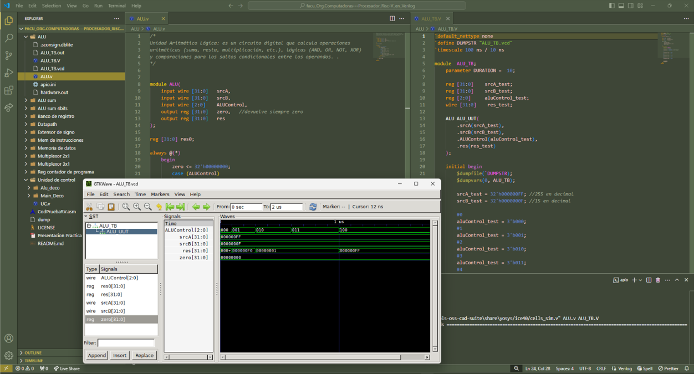

# 📌 Simulador de un procesador Risc-V 32I monociclo.

## 📝 Descripción
Circuito funcional que desarrollé en conjunto a mi compañero de cátedra que simula el comportamiento con instrucciones reducidas del procesador
RISC-V 32 BITS Int. Relizado en el lenguaje de descripción de hardware verilog y testeado su funcionamiento con GTKWave cargando en hexadecimal 
las instrucciones en la memoria de instrucciones. 
[Informe del Trabajo práctico final](https://github.com/CodigoWaldo/facu_Org.Computadoras---Procesador_Risc-V_en_Verilog/blob/main/Informe%20-%20Procesador%20RISC%20V.pdf)

---
## 🛠 Tecnologías Utilizadas
- Lenguaje: **Verilog**
- Librerías: **-**
- Herramientas: **GTK-Wave, VScode**

---
## 👤 Créditos:
- [Agustin Gregoret](https://github.com/LaguGrego)
- [Walter Voegeli](https://github.com/CodigoWaldo)
---
